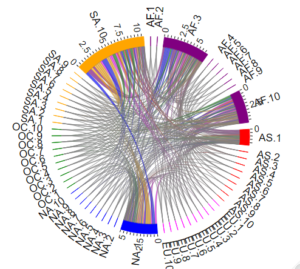

## SGNAR: Sparse-Group Network AutoRegressive Modeling 
This repository contains the code which implements the algorithm for the SGNAR model introduced in the paper [*"Discover Regional and Size Effects in Global Bitcoin Blockchain via Sparse-Group Network AutoRegressive Modeling"*](https://papers.ssrn.com/sol3/papers.cfm?abstract_id=3245031) as well as the Bitcoin blockchain data used in the analysis of said paper. 

### Code

The code contains of 2 files:

1. `main_ParaMatEst.R`

2. `BetaUpdate_SGNAR.R`

The first code file contains the 3-step algorithm as described in the paper as well as loads the data and sets the control parameters. The second code file is an internal code file which contains the gradient descent part of the SGNAR algorithm which updates the parameters. For the details on the SGNAR model and algorithm, please see the SGNAR paper: [view paper](https://papers.ssrn.com/sol3/papers.cfm?abstract_id=3245031)

### Data 

The repository contains 2 .RData files which contain the Bitcoin blockchain transactions. The daily transactions are grouped by their size and their geographical location. For the dataset with 10 groups per continent (`BlockchainData3Groups.RData`), the first group in each continent are the 10% lowest transactions, tenth group are the 10% highest. The column names are times indices, given as seconds since 01.01.1970 00:00:00 UTC. 

- Rows 1-10: Transactions from Africa

- Rows 11-20: Transactions from Asia

- Rows 21-30: Transactions from Europe

- Rows 31-40: Transactions from North America

- Rows 41-50: Transactions from Oceania

- Rows 51-60: Transactions from South America

For the dataset with 3 groups per continent  (`BlockchainData10Groups.RData`), the first group in each continent are the 33% lowest transactions, third group are the 33% highest. The column names are times indices, given as seconds since 01.01.1970 00:00:00 UTC. 

- Rows 1-3: Transactions from Africa

- Rows 4-6: Transactions from Asia

- Rows 7-9: Transactions from Europe

- Rows 10-12: Transactions from North America

- Rows 13-15: Transactions from Oceania

- Rows 16-18: Transactions from South America

The data are demeaned and cleaned by a GARCH(1,1) model. 

### Output

The code returns a list with 10 entries which contain the following information: 

- `All_store[[1]]` : list containing all optimized model for each combination of lambdas of the 2 sequences

- `All_store[[2]]` : matrix containing the iterations needed to optimize each model. If an optimized model reached the maximum of iterations, one may consider rerunning the estimation with different starting values

- `All_store[[3]]` : matrix storing the column indices of the columns found active in step 2 of the optimization 

- `All_store[[4]]` : the regularization parameters used for estimation

- `All_store[[5]]` : data used for model estimation

- `All_store[[6]]` : data used for model evaluation

- `All_store[[7]]` : indicator of optimal model

- `All_store[[8]]` : optimal lambda combination

- `All_store[[9]]` : optimal model

- `All_store[[10]]` : mean squared error of the models on the evaluation data

The information from the model can be plotted as e.g. a chorddiagram with the help of packages like `chorddiag`. The results are as in the paper: 

### Reference

When using the code or data in your own work, please reference to our paper. Thank you in advance!: 

Trimborn, S., Chen, Y., Zhang, J., (2020) Discover Regional and Size Effects in Global Bitcoin Blockchain via Sparse-Group Network AutoRegressive Modeling

The manuscript can be found here: [view paper](https://papers.ssrn.com/sol3/papers.cfm?abstract_id=3245031)